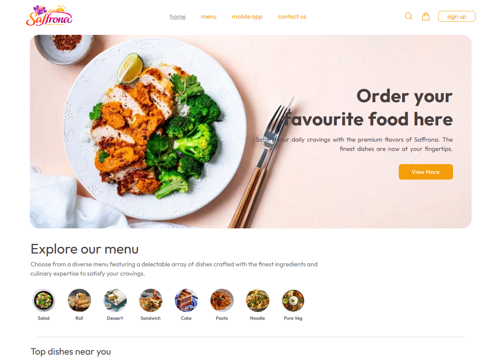

# 🌟 Saffrona - Modern Full-Stack Web Application

**Saffrona** is a premium, full-featured full-stack web application built with modern web technologies. It delivers a fast, responsive, and seamless user experience paired with a robust backend architecture.

🔗 **Live Demo:** [https://saffrona.netlify.app/](https://saffrona.netlify.app/)

---

## 📸 Preview

  

---

## 🚀 Technologies & Tech Stack

### Frontend
* 
* 
* 

### Backend & Database
* 
* 
* 

### Hosting & Deployment
*  (Frontend)
*  (Backend)

---

## ✨ Features

- 🔐 **Secure Authentication:** JWT-based user login, registration, and session management.
- 📱 **Fully Responsive Layout:** Optimized beautifully for Mobile, Tablet, and Desktop screens using TailwindCSS.
- ⚡ **Lightning Fast Performance:** Bundled with Vite for fast HMR (Hot Module Replacement) and optimized production builds.
- 📊 **Dynamic Data Management:** Real-time data retrieval, storage, and manipulation using MongoDB and Mongoose.
- 🛠️ **RESTful API Architecture:** Scalable and well-structured Express routes for seamless client-server communication.
- 🎨 **Elegant User Interface:** Smooth transitions, modern components, and custom interactive UI/UX designs.
